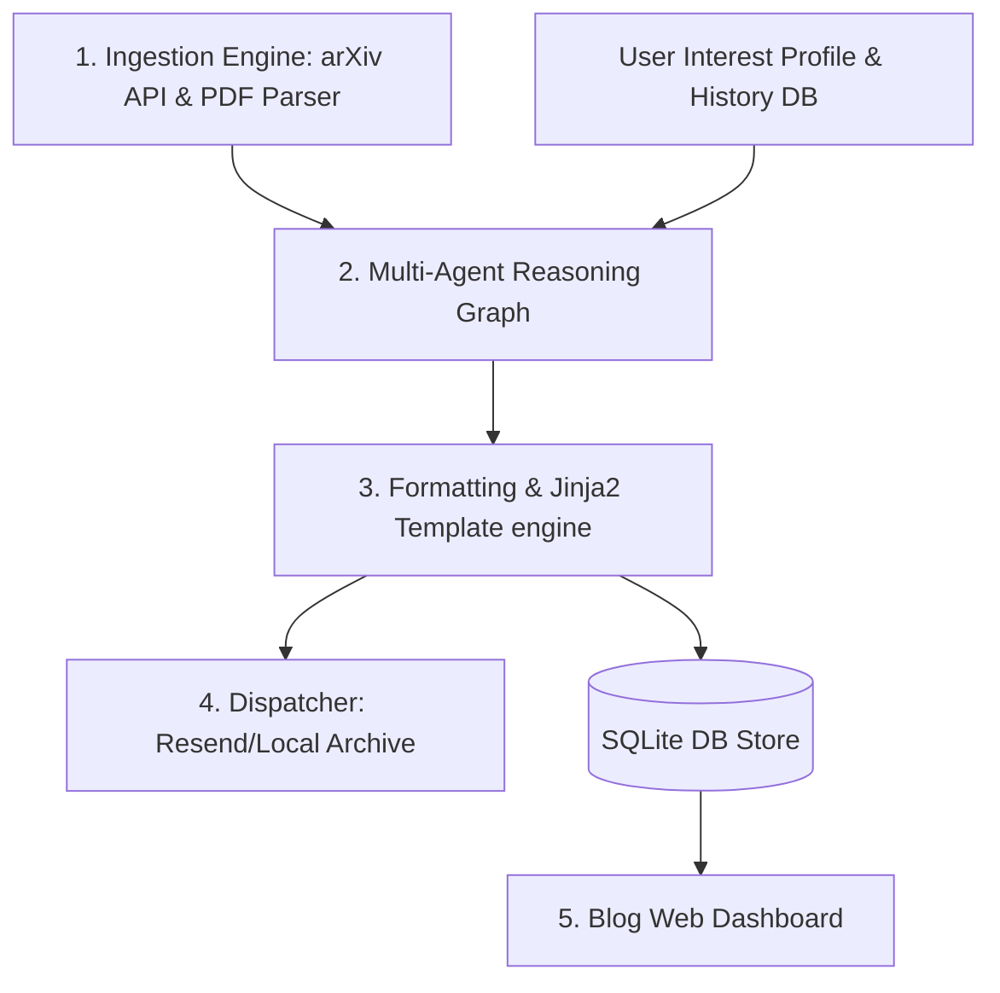

# System Design & AI Research Newsletter Agent

An automated, personalized, multi-agent newsletter curator and publisher that discovers research papers on System Design and AI, summarizes them, emails them to subscribers, and archives them to a beautiful blog frontend dashboard.

---

## 🎯 Goal
Build an automated pipeline that ingests computer science and AI research papers from arXiv, filters them for relevance based on a user interest profile, generates summarized newsletters using a multi-agent graph, dispatches the emails, and hosts the content on a local web dashboard.

---

## 🏗️ Component Architecture



### 1. Ingestion Engine & Topic Discovery ([scraper.py](file:///Users/vishwashrisairamvenkadathiriappasamy/vishwashrisairam/code/kaggle/newsletter-agent/app/app_utils/scraper.py))
*   **arXiv Queries**: Scrapes papers matching computer science and AI categories:
    *   `cs.DC` (Distributed, Parallel, and Cluster Computing)
    *   `cs.DB` (Databases)
    *   `cs.SE` (Software Engineering)
    *   `cs.AI` (Artificial Intelligence)
    *   `cs.LG` (Machine Learning / Deep Learning)
*   **Relevance Filtering**: Maps paper metadata (abstracts) against the User Interest Profile. An LLM agent (Gemini 1.5 Flash) scores relevance ($0.0 - 1.0$) and selects the top 3-5 papers exceeding $0.75$.
*   **PDF Ingestion**: Downloads the PDFs and extracts text using `pypdf` for analysis.

### 2. Multi-Agent Reasoning Graph ([agent.py](file:///Users/vishwashrisairamvenkadathiriappasamy/vishwashrisairam/code/kaggle/newsletter-agent/app/agent.py))
Orchestrated using the ADK 2.0 graph engine:
*   **Classifier / Router Node**: Initiates the workflow.
*   **Academic Summarizer Node**: Takes paper text and extracts:
    *   *Problem Statement*
    *   *Proposed System Architecture*
    *   *Key Trade-offs / Limitations*
    *   *Real-World Industry Application*
*   **Newsletter Curator Node**: Compiles summaries, filters duplicate entries using reading history, and ranks posts by preference alignment.

### 3. Formatting & Template Engine
*   **Jinja2 CSS Templates**: Generates a responsive newsletter layout (sleek dark/light theme) using the files in [templates/](file:///Users/vishwashrisairamvenkadathiriappasamy/vishwashrisairam/code/kaggle/newsletter-agent/app/templates/).

### 4. Dispatcher ([mailer.py](file:///Users/vishwashrisairamvenkadathiriappasamy/vishwashrisairam/code/kaggle/newsletter-agent/app/app_utils/mailer.py))
*   Emails the newsletter using standard **SMTP** (e.g., Gmail with App Passwords) or falls back to the **Resend API**.
*   Saves local HTML backups.

### 5. Blog Frontend (Web Dashboard) ([fast_api_app.py](file:///Users/vishwashrisairamvenkadathiriappasamy/vishwashrisairam/code/kaggle/newsletter-agent/app/fast_api_app.py))
*   FastAPI web server serving Jinja2 templates.
*   Stores metadata and generated HTML in a local SQLite database ([db.py](file:///Users/vishwashrisairamvenkadathiriappasamy/vishwashrisairam/code/kaggle/newsletter-agent/app/app_utils/db.py)).
*   **Routes**:
    *   `GET /`: Homepage displaying all archived newsletters as blog posts.
    *   `GET /newsletter/{id}`: Detailed reader view showing the exact HTML rendered during that newsletter run.
    *   `POST /api/trigger`: Admin endpoint/button to trigger a manual run.

---

## ⚡ Quick Start & Development Setup

### 1. Prerequisites
Ensure you have:
*   [uv](https://docs.astral.sh/uv/getting-started/installation/) installed.
*   `google-agents-cli` tool installed:
    ```bash
    uv tool install google-agents-cli
    ```

### 2. Scaffold and Initialize
Run the scaffolding command to create the basic ADK 2.0 template:
```bash
agents-cli scaffold create newsletter-agent --deployment-target agent_runtime
```

### 3. Authentication & Configuration
Before deploying or provisioning, authenticate and configure your active Google Cloud project:

```bash
# 1. Login to agents-cli services
agents-cli login --interactive

# 2. Login to gcloud CLI
gcloud auth login

# 3. Configure the target GCP Project ID
gcloud config set project <YOUR_GCP_PROJECT_ID>
```

Verify your active credentials and project:
```bash
gcloud config list
```

### 4. Environment Configuration (`.env`)
Create a `.env` file in the root of the repository to configure your credentials and connection variables:

```bash
# GCP Configuration
GOOGLE_CLOUD_PROJECT=your-project-id
GOOGLE_CLOUD_LOCATION=us-central1
LOGS_BUCKET_NAME=your-gcs-bucket-name

# SMTP Configuration (Gmail App Passwords, etc.)
SMTP_HOST=smtp.gmail.com
SMTP_PORT=587
SMTP_USER=your-email@gmail.com
SMTP_PASSWORD=your-app-password

# Resend API Key for Email Delivery Fallback
RESEND_API_KEY=your-resend-api-key

# Test default email
SUBSCRIBER_EMAIL=your-recipient-email@gmail.com
```

*Note: The `.env` file is gitignored by default to protect credentials.*

### 5. Install Dependencies
Declare your libraries in `pyproject.toml` (e.g., `arxiv`, `pypdf`, `fastapi`, `uvicorn`, `resend`, `jinja2`) and sync the environment:
```bash
agents-cli install
```

### 5. Launch the Local Dev Environment
Start the hot-reloaded ADK playground:
```bash
agents-cli playground
```

---

## 📁 Repository Structure
*   [app/agent.py](file:///Users/vishwashrisairamvenkadathiriappasamy/vishwashrisairam/code/kaggle/newsletter-agent/app/agent.py) — Core graph workflow logic (ADK 2.0).
*   [app/fast_api_app.py](file:///Users/vishwashrisairamvenkadathiriappasamy/vishwashrisairam/code/kaggle/newsletter-agent/app/fast_api_app.py) — FastAPI web server hosting the blog homepage and history archives.
*   [app/templates/](file:///Users/vishwashrisairamvenkadathiriappasamy/vishwashrisairam/code/kaggle/newsletter-agent/app/templates/) — Jinja2 layouts (`base.html`, `home.html`, `post.html`) using Vanilla CSS.
*   [app/app_utils/scraper.py](file:///Users/vishwashrisairamvenkadathiriappasamy/vishwashrisairam/code/kaggle/newsletter-agent/app/app_utils/scraper.py) — Ingestion client for arXiv and PDF texts.
*   [app/app_utils/db.py](file:///Users/vishwashrisairamvenkadathiriappasamy/vishwashrisairam/code/kaggle/newsletter-agent/app/app_utils/db.py) — SQLite database adapter archiving generated runs.
*   [app/app_utils/mailer.py](file:///Users/vishwashrisairamvenkadathiriappasamy/vishwashrisairam/code/kaggle/newsletter-agent/app/app_utils/mailer.py) — Resend/SendGrid API delivery client.
*   [tests/eval/datasets/](file:///Users/vishwashrisairamvenkadathiriappasamy/vishwashrisairam/code/kaggle/newsletter-agent/tests/eval/datasets/) — Folder containing evaluation datasets.

---

## 🧪 Evaluation Datasets & Testing

Evaluation datasets are located in the [tests/eval/datasets/](file:///Users/vishwashrisairamvenkadathiriappasamy/vishwashrisairam/code/kaggle/newsletter-agent/tests/eval/datasets/) directory and are used for verifying agent behavior.

### Running Evaluations

#### Default Dataset
```bash
# Generate traces using the default dataset
agents-cli eval generate
agents-cli eval grade
```

#### Custom Dataset
```bash
# Generate traces for a custom dataset
agents-cli eval generate --dataset tests/eval/datasets/custom-dataset.json --output custom_traces/
agents-cli eval grade --metrics general_quality --traces custom_traces/
```

### Dataset Format

Each dataset file follows the Gemini Enterprise Agent Platform Evaluation dataset format. An evaluation case may use **either** of two shapes:

**Shape A — single-prompt case:**
```json
{
  "eval_cases": [
    {
      "eval_case_id": "unique_case_id",
      "prompt": {
        "role": "user",
        "parts": [{"text": "User message"}]
      }
    }
  ]
}
```

**Shape B — continued-conversation case (the "N+1" pattern):**
The case carries prior turns in `agent_data` and the last turn ends with a user message; `eval generate` appends the next agent response.
```json
{
  "eval_cases": [
    {
      "eval_case_id": "unique_case_id",
      "agent_data": {
        "turns": [
          {
            "turn_index": 0,
            "events": [
              {"author": "user",  "content": {"role": "user",  "parts": [{"text": "First user message"}]}},
              {"author": "agent", "content": {"role": "model", "parts": [{"text": "First agent reply"}]}},
              {"author": "user",  "content": {"role": "user",  "parts": [{"text": "Follow-up user message"}]}}
            ]
          }
        ]
      }
    }
  ]
}
```

### Key Fields
*   `eval_cases`: Array of evaluation cases.
*   `eval_case_id`: Unique identifier for the evaluation case (optional).
*   `prompt`: A single user message (Shape A).
*   `agent_data.turns`: Prior conversation turns ending with a user message (Shape B).

### Creating Custom Datasets
1.  **By Hand**: Copy `basic-dataset.json` as a template and manually add evaluation cases.
2.  **Synthesize**: Use the synthetic dataset generation command to generate conversation scenarios:
    ```bash
    agents-cli eval dataset synthesize --count 10
    ```

### Discovering Metrics
You can discover available out-of-the-box evaluation metrics by running:
```bash
agents-cli eval metric list
```

### Advanced Evaluation Operations
Once you have a baseline, the eval surface provides additional optimization and regression checks:
*   `agents-cli eval compare BASE CAND` — Compare two grade-results files (regression check).
*   `agents-cli eval analyze RESULTS` — Cluster failure modes from a grade-results file.
*   `agents-cli eval optimize` — Auto-tune your agent's prompts using eval data.
